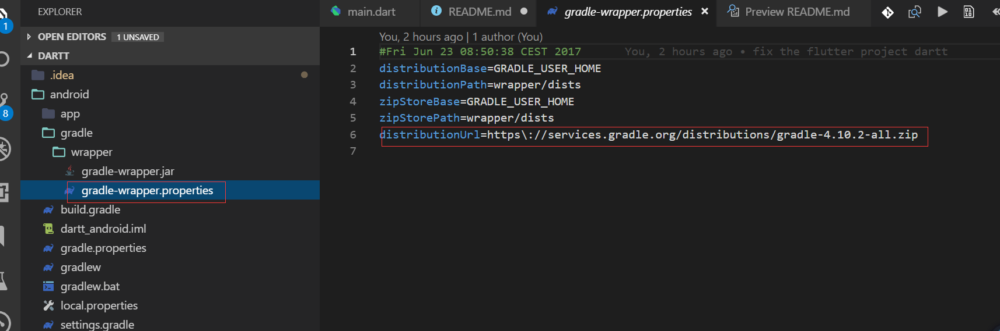
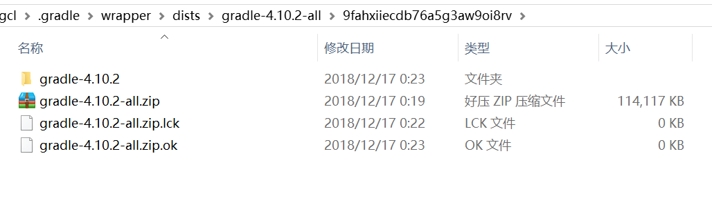

### Dart Learning

https://www.dartlang.org/guides/language/language-tour

### Resource

-   [const 与 final 的区别](http://han.guokai.blog.163.com/blog/static/136718271201321911119331/)

### Flutter 项目一直卡在 Initializing gradle...解决方法：

1. 在项目中全局搜索 gradle 找到下面文件：

    

2. 手动在[gradle 服务官网](http://services.gradle.org/distributions/)下载上面指定的文件。这里是 gradle-4.10.2-all.zip

3. 在用户目录[~] 中定位到下面的目录：
   

4. 清空目录，将刚刚下载的 zip 文件放在这里。

5. 重新启动 Flutter 项目。

**2019-01-27**
